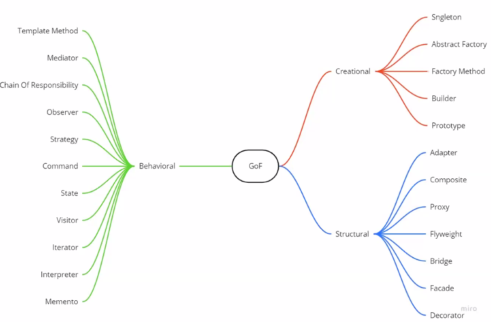
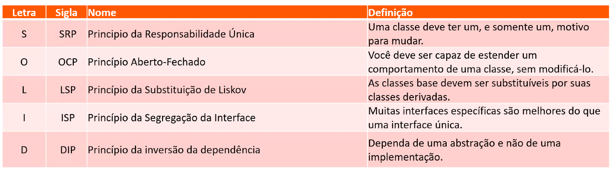

# Aplicando Design Patterns na prática com C#

> Victor Frutuoso

## Desenvolver aplicações com C# confiáveis e estruturadas com as melhores práticas do mercado

## Definição

Design Patterns são soluções para problemas recorrentes. São abordagens que podem ser reaproveitadas em seu código para garantir padrões, além de facilitar a construção da aplicação, facilita a comunicação entre times de desenvolvimento.

## Porque eu devo usar?

* Produtividade - são modelos que podem ser reaproveitados para resolver problemas comuns em projetos de software.

* Manutenção - são soluções padronizadas de baixo acoplamento

* Termos Universais - são modelos conhecidos e universais em projeto de software, o que facilita a comunicação e mantenabilidade em projetos de software.

## Atenção! Alguns alertas...

### Desuso

Alguns padrões foram criados para resolver problemas que não eram solucionáveis em linguagens mais antigas, mas que podem ser implementados hoje com recursos modernos. Ex.: strategy pode ser substituído pelo uso de funções anônimas.

### Soluções prontas

Padrões de projeto não são receitas prontas que podem ser copiados de projeto para projeto. Entenda o padrão, que tipo de problema pode ser resolvido com ele. Então implemente sua solução.

### A 'bala de prata'

Padrões de projeto não são soluções universais, que servem para todos os problemas. Problemas mais simples, podem não necessitar de nenhum padrão. Entenda o problema, e qual a melhor solução para resolver.

## Os princípios do S.O.L.I.D

Problemas comuns quando não se usa SOLID - mantenabilidade, código duplicado, dificuldade de reaproveitamento de código, dificuldade de aplicar testes.

Benefícios do SOLID - facilidade para novas implementações, fácil manutenção, reaproveitamento de código.

## Exemplo prático

[Design Pattern Samples](https://github.com/fructuoso/DesignPatternSamples)

Aplicação de exemplo de aplicação de Design Patterns na prática em um projeto WebAPI .NET Core 3.1 utilizada na palestra "Aplicando design patterns na prática com C#".

O arquivo README do repositório possui instruções sobre as implementações de patterns para resolver os problemas apresentados, para cada pattern.